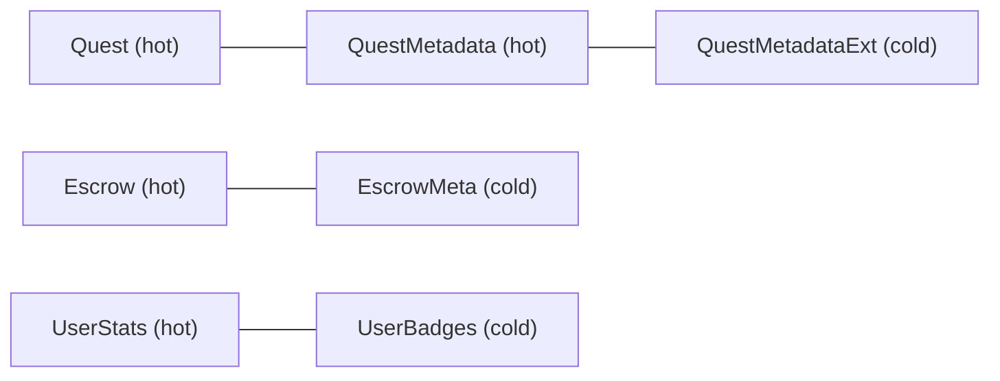

# Storage Layout Reference

## Overview

This document is the canonical map of every on-chain storage key used by the EarnQuest contract. All persistent state is keyed through the `DataKey` enum in [`storage.rs`](../src/storage.rs). There is no separate `StorageKey` type — `DataKey` is the single source of truth.

Developers **must** consult this document before adding, renaming, or removing storage keys. Undocumented or colliding keys can break contract upgrades and state migrations. See also [BACKWARD_COMPATIBILITY_POLICY.md](./BACKWARD_COMPATIBILITY_POLICY.md).

---

## Storage Durability & TTL

| Property | Value |
| :--- | :--- |
| **Storage API** | `env.storage().instance()` |
| **Durability** | Instance (persistent) |
| **TTL management** | None in contract code — entries live for the contract instance lifetime and are extended automatically by the Soroban host on access |
| **Temporary storage** | Not used |

All keys listed below share the same durability model. No key has a custom TTL or expiration policy enforced by contract logic.

---

## Naming Convention

When adding a new `DataKey` variant, follow these rules:

1. **PascalCase variant names** — e.g. `QuestMetadata`, `PlatformQuestsCreated`.
2. **Domain prefix grouping** — related keys share a prefix:
   - `Quest*`, `Platform*`, `Unpause*`, `Token*`, `Oracle*`, `Badge*`, `Creator*`, `Escrow*`.
3. **Composite keys for entities** — use tuple variants with the natural identifier order:
   - `(quest_id, submitter)` for submissions and commitments
   - `(quest_id, initiator)` for disputes
   - `(role, address)` for role membership
   - `(owner, spender)` for token allowances
4. **Hot/cold split suffix** — when splitting a struct for gas optimization, use a base name plus an `Ext` or `Meta` suffix:
   - `QuestMetadata` + `QuestMetadataExt`
   - `Escrow` + `EscrowMeta`
   - `UserStats` + `UserBadges`
5. **Append-only enum evolution** — new variants are added at the **end** of the `DataKey` enum. Never reorder or rename existing variants (breaks ledger deserialization). See [BACKWARD_COMPATIBILITY_POLICY.md](./BACKWARD_COMPATIBILITY_POLICY.md).
6. **Update checklist** — when adding a variant:
   - Add it to the end of `DataKey` in `storage.rs`
   - Add a sample to `all_data_key_variants()` in the `storage_key_tests` module
   - Increment `DOCUMENTED_VARIANT_COUNT` in the test module
   - Add a row to the table below

---

## DataKey Registry

**Total variants:** 44 (as of contract version tracked in `ContractVersion`)

### Quest Domain

| Key | Parameters | Value Type | Purpose |
| :--- | :--- | :--- | :--- |
| `Quest` | `quest_id: Symbol` | `Quest` | Core quest state (creator, reward, status, claims) |
| `QuestMetadata` | `quest_id: Symbol` | `QuestMetadataCore` | Hot-path metadata (title, description, category) |
| `QuestMetadataExt` | `quest_id: Symbol` | `QuestMetadataExtended` | Cold-path metadata (requirements, tags) |
| `Submission` | `quest_id: Symbol`, `submitter: Address` | `Submission` | Per-user quest submission and claim status |
| `QuestIds` | — | `Vec<Symbol>` | Index of all registered quest IDs |

### User Domain

| Key | Parameters | Value Type | Purpose |
| :--- | :--- | :--- | :--- |
| `UserStats` | `user: Address` | `UserCore` | Hot-path user stats (XP, level, quests completed) |
| `UserBadges` | `user: Address` | `UserBadges` | Cold-path badge collection |
| `CreatorStats` | `creator: Address` | `CreatorStats` | Per-creator reputation and activity counters |

### Escrow Domain

| Key | Parameters | Value Type | Purpose |
| :--- | :--- | :--- | :--- |
| `Escrow` | `quest_id: Symbol` | `EscrowBalances` | Hot-path escrow balances and active flag |
| `EscrowMeta` | `quest_id: Symbol` | `EscrowMeta` | Cold-path escrow metadata (depositor, token, created_at) |

### Dispute & Verification Domain

| Key | Parameters | Value Type | Purpose |
| :--- | :--- | :--- | :--- |
| `Dispute` | `quest_id: Symbol`, `initiator: Address` | `Dispute` | Open dispute record |
| `Commitment` | `quest_id: Symbol`, `submitter: Address` | `Commitment` | Proof commitment hash for front-running prevention |
| `VerifierStake` | `quest_id: Symbol`, `verifier: Address` | `VerifierStake` | Verifier stake deposit for a quest |

### Admin & Access Control

| Key | Parameters | Value Type | Purpose |
| :--- | :--- | :--- | :--- |
| `Admin` | `address: Address` | `bool` | Legacy admin flag (also mirrored via `Role`) |
| `Role` | `role: Role`, `address: Address` | `bool` | Role membership (`SuperAdmin`, `Admin`, `Pauser`, etc.) |
| `ContractAdmin` | — | `Address` | Primary contract administrator address |
| `ContractVersion` | — | `u32` | Deployed contract version number |
| `ContractConfig` | — | `Vec<(String, String)>` | Arbitrary string key-value configuration |
| `Initialized` | — | `bool` | One-time initialization guard |
| `Paused` | — | `bool` | Global pause flag (key presence = paused) |
| `ReentrancyGuard` | — | `bool` | Mutex flag during non-reentrant entry points |

### Unpause Governance

| Key | Parameters | Value Type | Purpose |
| :--- | :--- | :--- | :--- |
| `UnpauseApproval` | `round: u32`, `admin: Address` | `bool` | Per-admin approval for a specific unpause round |
| `UnpauseThreshold` | — | `u32` | Minimum approvals required to schedule unpause |
| `UnpauseRound` | — | `u32` | Current unpause approval cycle ID |
| `UnpauseApprovalCount` | — | `u32` | Approvals recorded in the current round |
| `UnpauseTimelockSeconds` | — | `u64` | Delay after approvals before unpause executes |
| `ScheduledUnpauseTime` | — | `u64` | Ledger timestamp when unpause becomes executable |

### Platform Statistics

Platform-wide counters are stored as individual keys for atomic single-field updates. The `PlatformStats` struct is assembled on read from these counters.

| Key | Parameters | Value Type | Purpose |
| :--- | :--- | :--- | :--- |
| `PlatformStats` | — | *(reserved)* | **Legacy / unused.** Do not write. Stats use individual counters below. |
| `PlatformQuestsCreated` | — | `u64` | Total quests ever created |
| `PlatformSubmissions` | — | `u64` | Total submissions received |
| `PlatformRewardsDistributed` | — | `u128` | Total reward tokens distributed |
| `PlatformActiveUsers` | — | `u64` | Unique active user count |
| `PlatformRewardsClaimed` | — | `u64` | Total rewards claimed |

### Oracle Domain

| Key | Parameters | Value Type | Purpose |
| :--- | :--- | :--- | :--- |
| `OracleConfig` | `oracle_address: Address` | `OracleConfig` | Per-oracle configuration |
| `OracleAddresses` | — | `Vec<Address>` | Registry of all oracle addresses |

### Token Domain (Native EQT)

| Key | Parameters | Value Type | Purpose |
| :--- | :--- | :--- | :--- |
| `Balance` | `address: Address` | `i128` | Token balance for an account |
| `Allowance` | `owner: Address`, `spender: Address` | `i128` | Approved spending allowance |
| `TokenName` | — | `String` | Token display name |
| `TokenSymbol` | — | `String` | Token ticker symbol |
| `TokenDecimals` | — | `u32` | Token decimal places |

### Badge Domain

| Key | Parameters | Value Type | Purpose |
| :--- | :--- | :--- | :--- |
| `BadgeType` | `id: Symbol` | `BadgeType` | Registered badge type definition |
| `BadgeTypeIds` | — | `Vec<Symbol>` | Index of all badge type IDs |

### Creator Level Gating

| Key | Parameters | Value Type | Purpose |
| :--- | :--- | :--- | :--- |
| `MinCreatorLevel` | — | `u32` | Minimum user level required to create quests |
| `CreatorWhitelist` | `address: Address` | `bool` | Addresses exempt from the level requirement |

---

## Hot / Cold Path Splits

Several entities are split across two keys to reduce gas on high-frequency reads:



When upgrading, both halves of a split must remain compatible. Do not change one key's struct layout without a migration plan for the paired key.

---

## Duplicate Key Detection

A unit test in `storage.rs` (`storage_key_tests::test_all_data_key_variants_are_unique`) writes a distinct marker to instance storage for every `DataKey` variant and verifies that no two variants resolve to the same ledger key.

Run the test:

```bash
cd contracts/earn-quest
cargo test storage_key_tests
```

If this test fails after adding a key, two variants are colliding on the ledger — resolve before merging.

---

## Related Documents

- [BACKWARD_COMPATIBILITY_POLICY.md](./BACKWARD_COMPATIBILITY_POLICY.md) — allowed and forbidden storage schema changes
- [VERSIONING_STRATEGY.md](./VERSIONING_STRATEGY.md) — contract version semantics
- [`storage.rs`](../src/storage.rs) — authoritative `DataKey` definition and accessor functions
- [`types.rs`](../src/types.rs) — value struct definitions
